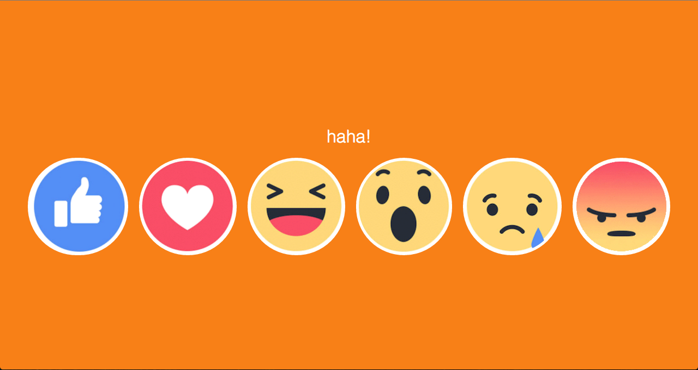

# JavaScript Reactions

--------------

Disclaimer

I am not affiliated with the usage of the Facebook reaction icons in the page, I am merely just using them for my learning benefit. I am not responsible for those who use this source code in the wrong context, as my main goal is to display what I am merely learning.

--------------

In this webpage, JavaScript is responding to mouse related events, to change the webpage to suit a particular emotion that the various images are displaying. The JavaScript is embedded within the HTML page, as well as the CSS.

In the future endeavours I'll look into adding sounds to the "reactions".

Here is a screenshot of what the webpage would like when it "reacts":

